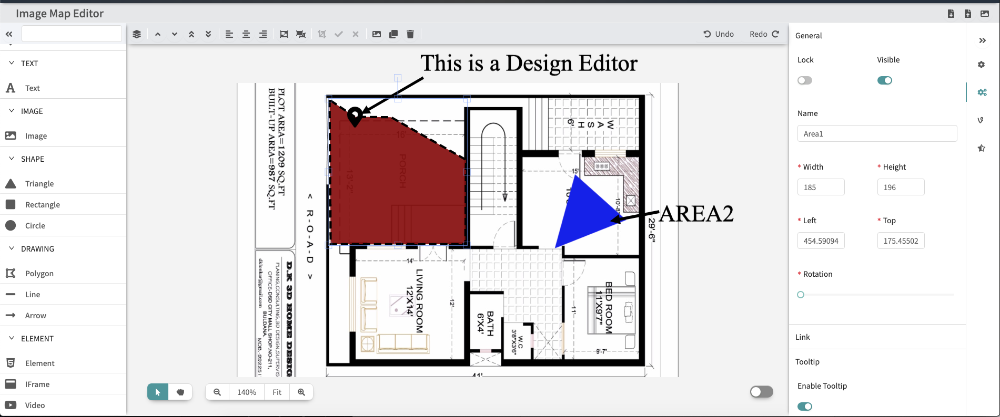

# React Design Editor

# Dependencies
- React.js
- fabric.js
- interact.js
- anime.js
- fontawesome5
- webpack4
- babel

# Getting Started
- npm install
- npm start
- http://localhost:8080 

# Image Map

# Features
- [x] Add
- [x] Remove
- [x] Resize
- [x] Clone
- [x] Tooltip
- [x] Reorder
- [x] Zoom
- [x] Preview
- [x] Copy & Paste
- [x] Drag & Drop
- [x] Upload (Drag & Drop)
- [x] Alignments
- [x] Drawing - Polygon, Link, Line, Arrow Line
- [x] Export / Import - JSON
- [x] Video
- [x] Dom Element
- [x] Code Editor - HTML / CSS / JS / Preview
- [x] iframe
- [x] Animation - Fade / Bounce / Shake / Scaling / Rotation / Flash
- [x] Icon Chooser - fontawesome 5.2.0 free version
- [x] Google Fonts - 20 fonts
- [x] Align Guidlines - moving
- [x] Interaction Mode - grap / selection
- [x] Group / Ungroup
- [x] Image Cropping
- [x] Snap To Grid
- [x] Multiple Layout - Fixed / Responsive / Fullscreen / Grid
- [x] Context menu
- [x] Save Image - Canvas, Target Object
- [ ] Wireframes - development
- [ ] Multiple Map - development
- [ ] Undo / Redo - development
